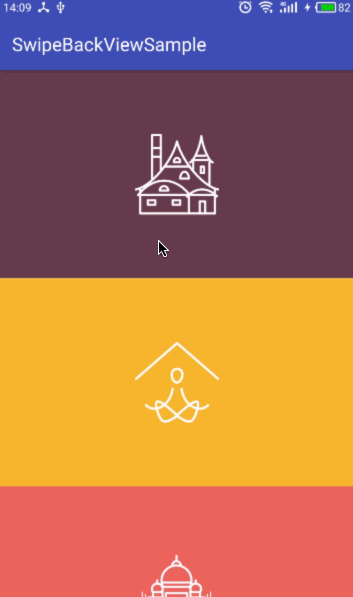

# SwipeBackView

A very simple and less feature custom view to help swipe back the activity. It is not powerful but just works.

## Note

core code: [SwipeBackView.java](./SwipeBackView/swipebackview/src/main/java/com/baurine/swipebackview/SwipeBackView.java)

Implementation thinking: 

- handle the view touch event in `onTouchEvent()`;
- when `ACTION_DOWN` comes, return true; 
- when `ACTION_MOVE`, let the activity decorview scroll its content as move action by `scrollBy()`; 
- when `ACTION_UP`, if decorview scroll distance not beyond the threshold (default is 1/3 decoreview width), let decorview scroll its content back to original position by scroller, else, call listener's `onSwipeBack()` listener, the default listener will finish the activity in callback.

## Samples

The materials come from Yalantis's [Phoenix](https://github.com/Yalantis/Phoenix), thanks.

## Getting Started

### Step 1 - Add the JitPack repository to your root `build.gradle` at the end of repositories:

    allprojects {
      repositories {
        ...
        maven { url 'https://jitpack.io' }
      }
    }

### Step 2 - Add the dependency in your app `build.gradle`:

    dependencies {
      compile 'com.github.baurine:swipebackview:${latest-version}'
    }

`latest-version`: see top JitPack badge.

## Usage

### Step 1 - Add SwipeBackView to xml layout

    <!-- activity_detail.xml -->
    <RelativeLayout
        android:id="@+id/rl_root"
        xmlns:android="http://schemas.android.com/apk/res/android"
        android:layout_width="match_parent"
        android:layout_height="match_parent"
        android:background="@color/eggplant">

        <ImageView
            android:id="@+id/iv_icon"
            android:layout_width="wrap_content"
            android:layout_height="wrap_content"
            android:layout_centerInParent="true"
            android:src="@drawable/icon_1"/>

        <com.baurine.swipebackview.SwipeBackView
            android:id="@+id/swipe_back_view"
            android:layout_width="50dp"
            android:layout_height="match_parent"/>
    </RelativeLayout>

### Step 2 - Define a transparnt backgroud theme for target Activity

    <!-- styles.xml -->
    

    <!-- AndroidManifest.xml -->
    <activity
        android:name=".DetailActivity"
        android:theme="@style/Transparent"/>

### Step 3 - Add optional SwipeBackListener for SwipeBackView in Activity

SwipeBackView internal has its default SwipeBackListener, but if you want to define the custom activity enter and exit animation, then you can set yourself SwipeBackListener.

    // DetailActivity.java
    private void initViews() {
        // ...
        ((SwipeBackView) findViewById(R.id.swipe_back_view)).setSwipeBackListener(
                new SwipeBackView.SwipeBackListener() {
                    @Override
                    public void onSwipeBack() {
                        finish();
                        overridePendingTransition(R.anim.nothing,
                                R.anim.out_slide_to_right);
                    }
                }
        );
    }

License
-------

    Copyright 2017 baurine.

    Licensed under the Apache License, Version 2.0 (the "License");
    you may not use this file except in compliance with the License.
    You may obtain a copy of the License at

       http://www.apache.org/licenses/LICENSE-2.0

    Unless required by applicable law or agreed to in writing, software
    distributed under the License is distributed on an "AS IS" BASIS,
    WITHOUT WARRANTIES OR CONDITIONS OF ANY KIND, either express or implied.
    See the License for the specific language governing permissions and
    limitations under the License.
